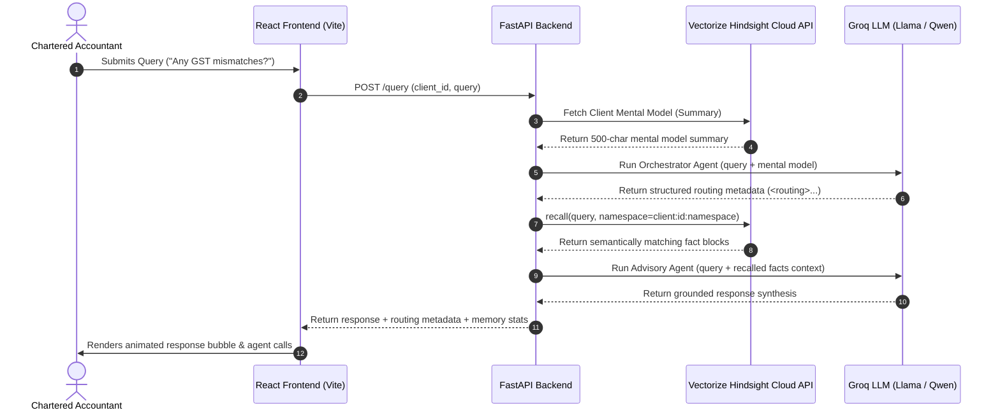

# CAI — Chartered Accountant Intelligence
### Persistent, Memory-First Multi-Agent Tax Advisory Operating System


CAI is a production-grade AI-powered Chartered Accountant assistant. Unlike standard conversational AI systems that lose context between sessions, CAI implements a decoupled, persistent memory architecture powered by the **Vectorize Hindsight Cloud API**. It coordinates a network of specialized LLM agents (routing, advisory, document parsing, notices, YoY delta comparison, and anomaly detection) with real-time vector memory recall, fully observed and traced via **LangSmith**.

---

## Table of Contents
1. [Executive Summary & Vision](#1-executive-summary--vision)
2. [The Core Problem: Context Fragmentation in Tax Prep](#2-the-core-problem-context-fragmentation-in-tax-prep)
3. [The Solution: Decoupled Persistent Memory Architecture](#3-the-solution-decoupled-persistent-memory-architecture)
4. [System Architecture & System Design](#4-system-architecture--system-design)
5. [Specialized Multi-Agent Orchestration](#5-specialized-multi-agent-orchestration)
6. [Data Flow & Execution Sequences](#6-data-flow--execution-sequences)
7. [Observability & Tracing via LangSmith](#7-observability--tracing-via-langsmith)
8. [Hindsight Vector Memory Schema & Storage Design](#8-hindsight-vector-memory-schema--storage-design)
9. [Model Usage, Token Budgets, & Error Resilience](#9-model-usage-token-budgets--error-resilience)
10. [Local Development & Setup Guide](#10-local-development--setup-guide)
11. [Step-by-Step Judge Demo Flow](#11-step-by-step-judge-demo-flow)
12. [Project Structure](#12-project-structure)

---

## 1. Executive Summary & Vision

Chartered Accountants (CAs) spend a disproportionate amount of time gathering client context, looking up past tax returns, cross-referencing GST filings, and checking open compliance notices. CAI transforms this workflow by introducing a persistent "mental model" for each client. By anchoring a specialized multi-agent LLM system directly to a secure, Assessment-Year-aware memory bank, CAI provides CAs with a cognitive assistant that never forgets client details, alerts them to financial anomalies, parses Form 16s on upload, and generates grounded, audit-ready advisory.

---

## 2. The Core Problem: Context Fragmentation in Tax Prep

Accounting and tax preparation are plagued by three fundamental challenges when interacting with standard AI tools:
* **The Context Reset Problem**: General-purpose AI assistants (like ChatGPT or Claude) treat every interaction as an isolated session. A CA must manually re-upload documents, copy-paste past tax histories, or re-type client preferences every single time they start a new query.
* **Compliance Risks & Hallucinations**: CAs operate in a zero-tolerance compliance environment. General LLMs tend to make up numbers or guess tax rules when they lack specific history, posing severe audit risks.
* **Chaotic Data Ingestion**: Client data arrives in unstructured formats—PDF scans, email threads, Tally sheets, and Excel logs. Structuring this data into a format that an LLM can parse and consistently remember over years is highly complex.

---

## 3. The Solution: Decoupled Persistent Memory Architecture

CAI solves these challenges by separating the **Reasoning Layer** (LLM) from the **Memory Layer** (Vector database).

```
                      ┌───────────────────────────┐
                      │    FastAPI Backend App    │
                      └─────────────┬─────────────┘
                                    │
            ┌───────────────────────┴───────────────────────┐
            ▼                                               ▼
┌───────────────────────┐                       ┌───────────────────────┐
│    REASONING LAYER    │                       │     MEMORY LAYER      │
│   (Groq / Llama-3)    │                       │ (Vectorize Hindsight) │
│                       │                       │                       │
│ • Intent Routing      │                       │ • tax_history         │
│ • Advisory Synthesis  │                       │ • notices             │
│ • Anomaly Detection   │                       │ • deductions          │
└───────────────────────┘                       └───────────────────────┘
```

* **Vectorize Hindsight Integration**: Every extracted fact, client preference, and historical tax figure is stored as a vector memory block inside Hindsight. These facts persist across sessions and are recalled dynamically based on query intent.
* **Zero-Hallucination Guardrails**: The Advisory Agent is instructed to use *only* the retrieved context from Hindsight. If the memory context for a query is empty, the agent explicitly states so rather than inventing numbers.
* **Durable Ingestion**: CAs simply drop client Form 16 PDFs. The system automatically extracts key figures, writes them to Hindsight, and immediately updates the client's memory map.

---

## 4. System Architecture & System Design


CAI's runtime is divided into three key systems:
1. **Frontend Interface (React/Vite)**: An editorial-brutalist SPA featuring high-performance micro-animations, a split-screen layout displaying the **Memory Audit View** beside the **Compliance Notice Panel**, and an interactive **Advisory Chat Panel** with drag-and-drop document upload.
2. **Orchestration Server (FastAPI)**: Coordinates query validation, runs python-based agent runtimes, manages asynchronous calls to the Hindsight API, and formats model responses.
3. **Observability Suite (LangSmith)**: Automatically traces agent execution, LLM latency, token spending, and retrieval accuracy for full visibility.

### System Data Flow Sequence

The following diagram details the sequence from a user's initial query through intent routing, vector database retrieval, and grounded response synthesis:



---

## 5. Specialized Multi-Agent Orchestration

CAI does not rely on a single LLM prompt. Instead, it coordinates six specialized agents:

### 1. Orchestrator Agent
* **File:** [orchestrator.py](file:///home/vijeta/CAI/backend/agents/orchestrator.py)
* **Model:** `llama-3.3-70b-versatile` (Temperature: 0)
* **Purpose:** Functions as the primary semantic router and DAG entry point. It receives the user's raw query alongside a 500-character snapshot of the client's mental model retrieved from Hindsight. 
* **Execution details:** Using a zero-temperature generation parameter for strict deterministic routing, it outputs a strict XML schema. The output schema enforces the extraction of:
  - `<intent>`: Categorized strict union types (`tax_query`, `notice`, `anomaly`, `advisory`, `yoy`, `document`, `general`).
  - `<agents>`: A dynamically generated comma-separated list of downstream agents to trigger in parallel or sequence (e.g., `memory,advisory`).
  - `<urgency>`: A classifier (`high`, `normal`, `low`) used to prioritize background job queues.
  - `<context_needed>`: Specific semantic namespaces required for the query (e.g., `tax_history,notices,deductions,income,preferences`).

### 2. Advisory Agent
* **File:** [advisory.py](file:///home/vijeta/CAI/backend/agents/advisory.py)
* **Model:** `llama-3.3-70b-versatile` (Temperature: 0.2)
* **Purpose:** The core synthesis engine for final response generation. 
* **Execution details:** It operates under strict zero-hallucination guardrails. The prompt is injected with the `memory_context` (retrieved from Hindsight), `doc_context` (extracted during the current session), and `tax_rules`. The agent is explicitly instructed to decline generating tax figures if the context arrays are empty. It outputs:
  - A direct, grounded answer.
  - Year-specific advice isolated by the assessment year strings (e.g., AY2024-25).
  - Anomaly flags and a confidence degradation warning if vector timestamps indicate the memory fact is over 9 months old.


### 3. Document Extraction Agent
* **File:** [document.py](file:///home/vijeta/CAI/backend/agents/document.py)
* **Purpose:** Handles deterministic and heuristic parsing of uploaded compliance documents.
* **Execution details:** Utilizes `PyMuPDF` (fitz) to convert PDF binaries into raw text streams. It applies pre-compiled regular expressions (`re.search(r"Gross Salary[^\d]*([\d,]+)", text)`) to identify financial entities like Gross Salary, Total Tax Deducted (TDS), and PAN. Upon successful extraction, it asynchronously triggers the Hindsight `retain()` SDK method, embedding the new facts directly into the client's persistent vector space under the `tax_history` and `income` namespaces.

### 4. Notice Agent
* **File:** [notice.py](file:///home/vijeta/CAI/backend/agents/notice.py)
* **Purpose:** A deterministic procedural agent that manages compliance deadlines and government scrutiny tracking.
* **Execution details:** It invokes `arecall()` on the `notices` namespace. Using pre-defined regex heuristics (e.g., `Section 143(1)`, `Section 148`), it parses human-readable notice strings into structured `datetime` objects. It computes the `days_left` delta against `date.today()`. Notices are then mutated into a structured JSON dictionary sorted algorithmically by urgency (`high` for <=14 days, `normal` for <=30 days, `low` otherwise) and segregated into `open` and `closed` queues.

### 5. YoY (Year-over-Year) Agent
* **File:** [yoy.py](file:///home/vijeta/CAI/backend/agents/yoy.py)
* **Purpose:** Computes financial deltas across different assessment years.
* **Execution details:** Triggers dual `recall()` requests on the `tax_history` namespace targeting specific Assessment Years (e.g., AY2023-24 vs AY2024-25). It parses the returned JSON blobs to extract gross income, tax paid, and refunds, returning a unified delta dictionary (`{"gross_delta": 50000, "tax_delta": 5000}`) that is fed into the Advisory Agent for trend summarization.

### 6. Anomaly Agent
* **File:** [anomaly.py](file:///home/vijeta/CAI/backend/agents/anomaly.py)
* **Model:** `qwen/qwen3-32b`
* **Purpose:** Acts as a specialized financial divergence detector.
* **Execution details:** It compares incoming structured data streams (like new bank statements or Tally exports) against a historical baseline fetched from memory. It is instructed to flag transactions that deviate from the established norm, outputting a strict pattern: `FLAG: <description> | SEVERITY: <level>`. If no deviation is detected, it outputs a strict `CLEAR` signal, terminating the anomaly pipeline branch early to save tokens.

---

## 6. Data Flow & Execution Sequences

### Phase 1: Query Ingestion & Semantic Routing
1. **HTTP Ingestion**: The FastAPI `/query` endpoint receives a JSON payload containing the `client_id` and the raw natural language `query`.
2. **Mental Model Lookup**: The backend executes an asynchronous `mental_model_retrieve(client_id)` call to the Hindsight API, fetching a 500-character synthetic baseline of the client to provide zero-shot context.
3. **Intent Classification**: The `Orchestrator Agent` evaluates the query alongside the mental model. It generates a rigid XML routing schema, specifying the exact downstream agents required (e.g., `[memory, advisory]`) and the semantic namespaces needed (e.g., `['tax_history', 'income']`).

### Phase 2: Targeted Vector Retrieval
4. **Namespace Filtering**: The system parses the Orchestrator's `context_needed` array.
5. **Asynchronous Recall**: For each required namespace, an `arecall(query, namespace=client:{id}:{namespace}, top_k=5)` request is fired concurrently.
6. **Confidence & Tag Processing**: The retrieved facts are mapped. The system parses Hindsight's `tags` (e.g., `conf_95`) to determine fact reliability and uses regex to map the fact to a specific Assessment Year (`AY_RE`).

### Phase 3: Synthesis & Delivery
7. **Agent Handoff**: The retrieved vector context is joined into a formatted string and injected into the `Advisory Agent`'s prompt, alongside any temporary session documents.
8. **LLM Generation**: The Advisory Agent synthesizes the grounded response, strictly adhering to the provided memory bounds.
9. **Streaming Delivery**: The generated text, along with metadata (tokens used, latency, routing path, specific memory keys referenced), is returned to the React frontend where it is rendered with micro-animations.

### Phase 4: Document Upload & Memory Retention Flow
1. **Binary Upload**: The CA drags a Form 16 PDF into the Advisory Agent panel. The file is uploaded via `multipart/form-data`.
2. **Local Parsing Pipeline**: The file is temporarily written to disk. The `Document Extraction Agent` initializes `PyMuPDF` to strip the text layer.
3. **Regex Entity Extraction**: The parser applies compliance-specific regex patterns to isolate the `gross`, `tds`, and `pan` entities from the noise.
4. **Hindsight Retention Generation**: The system constructs a natural language fact string (e.g., *"Form 16 uploaded. Gross salary verified at ₹1,500,000"*).
5. **Vector Embedding**: The backend calls `aretain()` to write this new string into the Hindsight database under the `client:{id}:tax_history` tag. Vectorize automatically computes the embeddings and indexes the fact.
6. **State Synchronization**: The frontend receives a `200 OK` response. It triggers a silent state refresh, performing a new `GET` request to reload the Memory Audit list, causing the UI to seamlessly display the newly ingrained memory.

---

## 7. Production Observability: LangSmith Integration


CAI utilizes **LangSmith** for full execution tracing. CAs and developers can inspect the trace log to audit how the AI reached a conclusion.

> [!TIP]
> Make sure your backend environment has `LANGCHAIN_TRACING_V2=true` and a valid API key set to capture traces.

### Captured Observability Data
* **LLM Input/Output Schemas**: Verify exactly what context was fed into `Llama-3.3-70b` and inspect the raw XML output by the Orchestrator.
* **Vector Match Latency**: View retrieval latency times for `arecall()` calls to the Hindsight API.
* **Token Spend Audits**: Track cumulative token expenditure for every individual user query.
* **Error Tracing**: Captures LLM rate-limits (`429`) or API network exceptions to guarantee operational reliability.

---

## 8. Hindsight Vector Memory Schema & Storage Design


CAI leverages **Vectorize Hindsight** as its core persistent memory layer. Data is embedded as high-dimensional vectors and isolated using strict hierarchical namespace routing to ensure client data is never cross-contaminated.

### Key Pattern Schema & Payload Structure
Data written to Hindsight is structured as a serialized JSON string representing a fact dictionary.
* **Payload Serialization**: `content = json.dumps({"key": key, "value": {"fact": fact_str}})`
* **Vector Indexing Tags**: Metadata tags (e.g., `["abcri1234d", "conf_95"]`) are attached for strict `tags_match="all_strict"` filtering during retrieval.
* **Client Fact Keys**: Mapped syntactically as `client:{client_id}:{namespace}:{record_id}`.

### Embedded Semantic Namespaces
When calling `hindsight.arecall()`, CAI restricts the embedding search space to specific logical silos:
* `tax_history`: Gross income vectors, total tax paid, refunds, and filing regimes (tracked via `AY_RE` matching).
* `income`: Current employment sources, salary details, business turnovers, and asset-based income.
* `deductions`: NLP-parsed declarations of 80C, 80D, standard, and custom deductions.
* `notices`: Raw strings representing scrutiny intimations, tax demands, and GST notices. These are post-processed by the Notice Agent into temporal deadlines.
* `preferences`: Client communication channels and dynamic risk tolerance thresholds.

### Seeded Demo Clients
CAI comes pre-seeded with synthetic, high-fidelity compliance records:

| Client Name | Client ID | PAN | Assessment History | Core Features in Seed |
| :--- | :--- | :--- | :---: | :--- |
| **Ramesh Iyer** | `abcri1234d` | `ABCRI1234D` | 3 Years | Home loan eligibility, 143(1) Intimation notice, Old Tax Regime preference. |
| **Priya Sharma** | `bcdps5678e` | `BCDPS5678E` | 2 Years | Freelance content writing income, PPF investments, New Tax Regime preference. |
| **MK Traders** | `cdemk9012f` | `CDEMK9012F` | 1 Year | Sole proprietorship, GSTIN tracking, GSTR notice, anomalous cash deposits. |
| **Suresh Karthik** | `dghsk3456g` | `DGHSK3456G` | 2 Years | Software engineer, RSU vesting, Capital Gains (LTCG) on stock sale. |
| **Nalini Anand** | `efgna7890h` | `EFGNA7890H` | 3 Years | Self-employed gynaecologist, Presumptive taxation 44ADA, HDFC fixed deposit. |

---

## 9. Model Usage, Token Budgets, & Error Resilience

To maintain high performance and low operational costs, CAI sets strict token boundaries:

### LLM Token Allocation
* **Orchestrator Agent**: Uses `llama-3.3-70b-versatile` with a token budget limit of `300` tokens and temperature `0` for deterministic routing.
* **Advisory Agent**: Uses `llama-3.3-70b-versatile` with a budget limit of `1024` tokens and temperature `0.2` to synthesize advisory responses under 300 words.
* **Anomaly Agent**: Uses `qwen/qwen3-32b` with a budget limit of `400` tokens to analyze transactional discrepancies.

### Rate-Limit Fallbacks & Exponential Backoff
All Groq API transactions are governed by a robust retry handler (`groq_call_with_retry`):
* **Max Retries**: `3`
* **Backoff Strategy**: Exponential backoff ($2^{\text{attempt}}$ seconds).
* **Grace Sequence**: Pauses for 1 second, then 2 seconds, and finally 4 seconds before failing, ensuring robustness against API rate limits.

---

## 10. Local Development & Setup Guide

### Prerequisites
* Python 3.10+
* Node.js v18+
* A valid Groq API Key
* A Vectorize Hindsight API Key

### 1. Setup Backend
1. Navigate to the backend directory:
   ```bash
   cd backend
   ```
2. Create and activate a virtual environment:
   ```bash
   python -m venv venv
   source venv/bin/activate  # On Windows: venv\Scripts\activate
   ```
3. Install dependencies:
   ```bash
   pip install -r requirements.txt
   ```
4. Create a `.env` file in the `backend/` directory:
   ```env
   GROQ_API_KEY=your-groq-api-key
   HINDSIGHT_API_KEY=your-hindsight-api-key
   LANGCHAIN_TRACING_V2=true
   LANGCHAIN_API_KEY=your-langsmith-api-key
   LANGCHAIN_PROJECT=cai-tax-agent
   ```
5. Seed the vector database with the demo clients:
   ```bash
   python data/seed_clients.py
   ```
6. Start the FastAPI server:
   ```bash
   uvicorn main:app --reload --port 8000
   ```

### 2. Setup Frontend
1. Navigate to the frontend directory:
   ```bash
   cd ../frontend
   ```
2. Install dependencies:
   ```bash
   npm install
   ```
3. Start the Vite development server:
   ```bash
   npm run dev
   ```
4. Open your browser and navigate to `http://localhost:5173`.

---

## 11. Step-by-Step Judge Demo Flow

To evaluate the capabilities of CAI, run the following interactive demo flow:

1. **Landing Page & Animations**: Open the app at `http://localhost:5173`. Check the staggered entrance animations, scroll through the staggered "How it Works" cards, and inspect the hover animations.
2. **Splash Screen & State Transition**: Watch the splash screen load, collapse, and open the dashboard. The application automatically redirects you to the **Advisory Agent (Chat)** view and runs the query.
3. **Inspect Multi-Agent Routing**: Observe the chat response. Below the agent response bubble, look at the tags labeled `↳ Called: orchestrator` and `↳ Called: memory`. This shows the multi-agent routing path.
4. **Memory Audit View**: Click on the **Memory Audit** tab. Filter by `Notices` or `Tax History` to inspect Ramesh Iyer's pre-seeded memories, complete with confidence scores and Assessment Years.
5. **Form 16 Ingestion**: Switch to the **Advisory Agent** view. Click the **Upload** button and select a sample Form 16 PDF. The Document Agent will parse the PDF, extract the financial details, and write the facts to Hindsight.
6. **Verify Persistent Memory Sync**: Go back to the **Memory Audit** view. Verify that the newly parsed facts from the Form 16 (for AY 2024-25) are now loaded in the client's database profile.
---

## 12. Project Structure

```text
CAI/
├── README.md                      # Comprehensive Architecture & Project Guide
├── backend/
│   ├── main.py                    # FastAPI Application Entry Point
│   ├── requirements.txt           # Python Dependency Manifest
│   ├── agents/                    # Multi-Agent Runtimes & Prompts
│   │   ├── orchestrator.py        # Intent Router Agent
│   │   ├── advisory.py            # Response Synthesis Agent
│   │   ├── document.py            # Form 16 Parser Agent
│   │   ├── notice.py              # Deadline Urgency Agent
│   │   ├── yoy.py                 # YoY Comparer Agent
│   │   └── anomaly.py             # Transaction Anomaly Agent
│   ├── data/
│   │   └── seed_clients.py        # Synthetic Data Seeding Script
│   ├── hindsight/
│   │   ├── client.py              # Hindsight Cloud API Asynchronous Client
│   │   └── keys.py                # Namespace Key Formatting Rules
│   └── utils/
│       └── groq_retry.py          # Exponential Backoff Rate-Limit Wrapper
└── frontend/
    ├── package.json               # Node Package Manifest
    ├── vite.config.js             # Vite Configuration Script
    └── src/
        ├── App.jsx                # Main Application Shell & History State Controller
        ├── index.css              # Typography & Design Token Styles
        ├── api/
        │   └── client.js          # Backend API client
        └── components/
            ├── Landing.jsx        # Brutalist Animated Landing Component
            ├── SplashScreen.jsx   # Animated Terminal Splash Sequence
            ├── ClientSidebar.jsx  # Client Selection List Sidebar
            ├── ChatPanel.jsx      # Advisory Agent Interface
            ├── MemoryAuditView.jsx# Memory Audit Interface
            ├── MemoryCard.jsx     # Individual Memory Fact Card
            └── NoticePanel.jsx    # Compliance Notices List Panel
```
