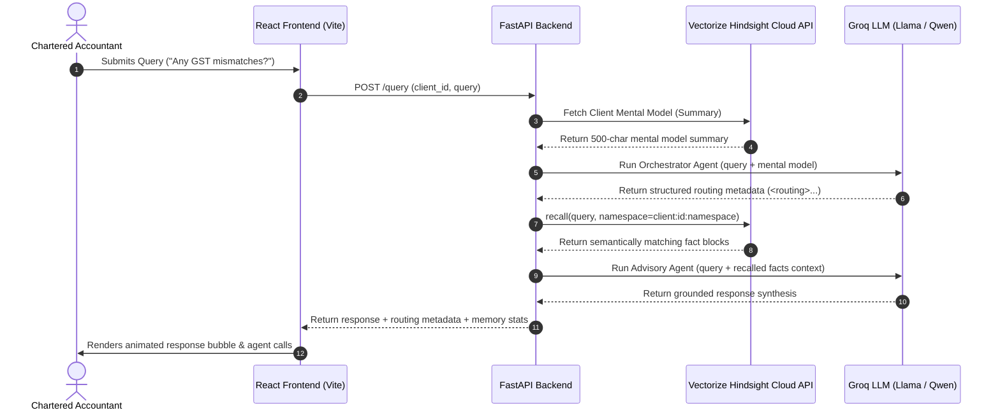

# CAI — Chartered Accountant Intelligence
### Persistent, Memory-First Multi-Agent System


CAI is a production-grade AI-powered Chartered Accountant assistant. Unlike standard conversational AI systems that lose context between sessions, CAI implements a decoupled, persistent memory architecture powered by the **Vectorize Hindsight Cloud API**. It coordinates a network of specialized LLM agents (routing, advisory, document parsing, notices, YoY delta comparison, and anomaly detection) with real-time vector memory recall, fully observed and traced via **LangSmith**.

---

## Table of Contents
1. [Executive Summary & Vision](#1-executive-summary--vision)
2. [The Core Problem: Context Fragmentation in Tax Prep](#2-the-core-problem-context-fragmentation-in-tax-prep)
3. [The Solution: Decoupled Persistent Memory Architecture](#3-the-solution-decoupled-persistent-memory-architecture)
4. [System Architecture & System Design](#4-system-architecture--system-design)
5. [Specialized Multi-Agent Orchestration](#5-specialized-multi-agent-orchestration)
6. [Data Flow & Execution Sequences](#6-data-flow--execution-sequences)
7. [Observability & Tracing via LangSmith](#7-observability--tracing-via-langsmith)
8. [Hindsight Vector Memory Schema & Storage Design](#8-hindsight-vector-memory-schema--storage-design)
9. [Model Usage, Token Budgets, & Error Resilience](#9-model-usage-token-budgets--error-resilience)
10. [Local Development & Setup Guide](#10-local-development--setup-guide)
11. [Step-by-Step Judge Demo Flow](#11-step-by-step-judge-demo-flow)
12. [Project Structure](#12-project-structure)

---

## 1. Executive Summary & Vision

Chartered Accountants (CAs) spend a disproportionate amount of time gathering client context, looking up past tax returns, cross-referencing GST filings, and checking open compliance notices. CAI transforms this workflow by introducing a persistent "mental model" for each client. By anchoring a specialized multi-agent LLM system directly to a secure, Assessment-Year-aware memory bank, CAI provides CAs with a cognitive assistant that never forgets client details, alerts them to financial anomalies, parses Form 16s on upload, and generates grounded, audit-ready advisory.

---

## 2. The Core Problem: Context Fragmentation in Tax Prep

Accounting and tax preparation are plagued by three fundamental challenges when interacting with standard AI tools:
* **The Context Reset Problem**: General-purpose AI assistants (like ChatGPT or Claude) treat every interaction as an isolated session. A CA must manually re-upload documents, copy-paste past tax histories, or re-type client preferences every single time they start a new query.
* **Compliance Risks & Hallucinations**: CAs operate in a zero-tolerance compliance environment. General LLMs tend to make up numbers or guess tax rules when they lack specific history, posing severe audit risks.
* **Chaotic Data Ingestion**: Client data arrives in unstructured formats—PDF scans, email threads, Tally sheets, and Excel logs. Structuring this data into a format that an LLM can parse and consistently remember over years is highly complex.

---

## 3. The Solution: Decoupled Persistent Memory Architecture

CAI solves these challenges by separating the **Reasoning Layer** (LLM) from the **Memory Layer** (Vector database).

```
                      ┌───────────────────────────┐
                      │    FastAPI Backend App    │
                      └─────────────┬─────────────┘
                                    │
            ┌───────────────────────┴───────────────────────┐
            ▼                                               ▼
┌───────────────────────┐                       ┌───────────────────────┐
│    REASONING LAYER    │                       │     MEMORY LAYER      │
│   (Groq / Llama-3)    │                       │ (Vectorize Hindsight) │
│                       │                       │                       │
│ • Intent Routing      │                       │ • tax_history         │
│ • Advisory Synthesis  │                       │ • notices             │
│ • Anomaly Detection   │                       │ • deductions          │
└───────────────────────┘                       └───────────────────────┘
```

* **Vectorize Hindsight Integration**: Every extracted fact, client preference, and historical tax figure is stored as a vector memory block inside Hindsight. These facts persist across sessions and are recalled dynamically based on query intent.
* **Zero-Hallucination Guardrails**: The Advisory Agent is instructed to use *only* the retrieved context from Hindsight. If the memory context for a query is empty, the agent explicitly states so rather than inventing numbers.
* **Durable Ingestion**: CAs simply drop client Form 16 PDFs. The system automatically extracts key figures, writes them to Hindsight, and immediately updates the client's memory map.

---

## 4. System Architecture & System Design


CAI's runtime is divided into three key systems:
1. **Frontend Interface (React/Vite)**: An editorial-brutalist SPA featuring high-performance micro-animations, a split-screen layout displaying the **Memory Audit View** beside the **Compliance Notice Panel**, and an interactive **Advisory Chat Panel** with drag-and-drop document upload.
2. **Orchestration Server (FastAPI)**: Coordinates query validation, runs python-based agent runtimes, manages asynchronous calls to the Hindsight API, and formats model responses.
3. **Observability Suite (LangSmith)**: Automatically traces agent execution, LLM latency, token spending, and retrieval accuracy for full visibility.

### System Data Flow Sequence

The following diagram details the sequence from a user's initial query through intent routing, vector database retrieval, and grounded response synthesis:



---

## 5. Specialized Multi-Agent Orchestration

CAI does not rely on a single LLM prompt. Instead, it coordinates six specialized agents:

### 1. Orchestrator Agent
* **File:** [orchestrator.py](file:///home/vijeta/CAI/backend/agents/orchestrator.py)
* **Model:** `llama-3.3-70b-versatile`
* **Purpose:** Acts as the routing brain. It analyzes the user's query against a 500-character snapshot of the client's mental model and outputs a strict XML schema defining:
  - `intent`: (`tax_query`, `notice`, `anomaly`, `advisory`, `yoy`, `document`, `general`)
  - `agents`: list of downstream agents to trigger.
  - `urgency`: (`high`, `normal`, `low`)
  - `context_needed`: specific Hindsight namespaces to fetch (e.g., `['tax_history', 'income']`).

### 2. Advisory Agent
* **File:** [advisory.py](file:///home/vijeta/CAI/backend/agents/advisory.py)
* **Model:** `llama-3.3-70b-versatile`
* **Purpose:** Synthesizes final answers. It receives the query, the context retrieved from Hindsight, and tax compliance regulations. It operates under strict guardrails to prevent hallucination and highlights warning indicators if memory facts are older than 9 months.


### 3. Document Extraction Agent
* **File:** [document.py](file:///home/vijeta/CAI/backend/agents/document.py)
* **Purpose:** Parses uploaded Form 16 PDFs. It uses PyMuPDF to extract text, locates gross salary, PAN, and TDS amounts, and automatically calls Hindsight's `retain` function to write these newly discovered facts into the client's vector space.

### 4. Notice Agent
* **File:** [notice.py](file:///home/vijeta/CAI/backend/agents/notice.py)
* **Purpose:** Retrieves entries in the `notices` namespace, calculates the number of days left before compliance deadlines, and tags notices as `high`, `normal`, or `low` urgency based on the remaining timeline.

### 5. YoY (Year-over-Year) Agent
* **File:** [yoy.py](file:///home/vijeta/CAI/backend/agents/yoy.py)
* **Purpose:** Compares the financial records of a client across two assessment years. It calculates the delta in gross income, total tax paid, and refunds, and returns a structured comparison model.

### 6. Anomaly Agent
* **File:** [anomaly.py](file:///home/vijeta/CAI/backend/agents/anomaly.py)
* **Model:** `qwen/qwen3-32b`
* **Purpose:** Compares incoming financial records or transaction logs against the client's historical baseline stored in memory. It flags significant deviations (e.g., unexpected cash deposits) with severity alerts (`high`/`medium`/`low`).

---

## 6. Data Flow & Execution Sequences

### Query Ingestion Flow
1. **Request Ingested**: The `/query` endpoint receives the request.
2. **Mental Model Lookup**: The backend reads the client summary from Hindsight's metadata layer to provide quick context.
3. **Intent Classification**: The Orchestrator parses the query and returns the required memory namespaces.
4. **Targeted Retrieval**: Asynchronous `arecall()` operations query only the required namespaces (e.g. `client:abcri1234d:tax_history`).
5. **Synthesis**: Recalled facts are joined into a formatted string and sent to the Advisory Agent.
6. **Delivery**: The response is streamed back to the frontend with details on which agents were executed and the exact memory entries used.

### Document Upload & Memory Retention Flow
1. **Upload Trigger**: The CA uploads a Form 16 PDF through the Advisory Agent panel.
2. **Local Processing**: The file is stored temporarily and parsed.
3. **Fact Extraction**: Gross Salary, PAN, and TDS are extracted.
4. **Hindsight Retention**: The backend calls `aretain()` to write the extracted facts into `client:{id}:tax_history` and `client:{id}:income` vector spaces.
5. **UI Refresh**: The frontend receives a success confirmation and triggers a silent state refresh to reload the updated memory audit list.

---

## 7. Production Observability: LangSmith Integration


CAI utilizes **LangSmith** for full execution tracing. CAs and developers can inspect the trace log to audit how the AI reached a conclusion.

> [!TIP]
> Make sure your backend environment has `LANGCHAIN_TRACING_V2=true` and a valid API key set to capture traces.

### Captured Observability Data
* **LLM Input/Output Schemas**: Verify exactly what context was fed into `Llama-3.3-70b` and inspect the raw XML output by the Orchestrator.
* **Vector Match Latency**: View retrieval latency times for `arecall()` calls to the Hindsight API.
* **Token Spend Audits**: Track cumulative token expenditure for every individual user query.
* **Error Tracing**: Captures LLM rate-limits (`429`) or API network exceptions to guarantee operational reliability.

---

## 8. Hindsight Vector Memory Schema & Storage Design


Client data is organized hierarchically inside Vectorize Hindsight using specific namespaces:

### Key Pattern Schema
* **Client Fact Keys**: `client:{client_id}:{namespace}:{record_id}`
* **Cross-Client Patterns**: `cross_client:patterns:{pattern_key}`

### Supported Namespaces
* `tax_history`: Gross income, total tax paid, refunds, and filing regimes for previous assessment years.
* `income`: Current employment sources, salary details, business turnovers, and asset-based income.
* `deductions`: 80C, 80D, standard, and custom deductions claimed by the client.
* `notices`: Scrutiny intimations, tax demands, GST notices, and corresponding deadlines.
* `preferences`: Client communication channels, preferred filing regime rules, and risk tolerance thresholds.


---

## 9. Model Usage, Token Budgets, & Error Resilience

To maintain high performance and low operational costs, CAI sets strict token boundaries:

### LLM Token Allocation
* **Orchestrator Agent**: Uses `llama-3.3-70b-versatile` with a token budget limit of `300` tokens and temperature `0` for deterministic routing.
* **Advisory Agent**: Uses `llama-3.3-70b-versatile` with a budget limit of `1024` tokens and temperature `0.2` to synthesize advisory responses under 300 words.
* **Anomaly Agent**: Uses `qwen/qwen3-32b` with a budget limit of `400` tokens to analyze transactional discrepancies.

### Rate-Limit Fallbacks & Exponential Backoff
All Groq API transactions are governed by a robust retry handler (`groq_call_with_retry`):
* **Max Retries**: `3`
* **Backoff Strategy**: Exponential backoff ($2^{\text{attempt}}$ seconds).
* **Grace Sequence**: Pauses for 1 second, then 2 seconds, and finally 4 seconds before failing, ensuring robustness against API rate limits.

---

## 10. Local Development & Setup Guide

### Prerequisites
* Python 3.10+
* Node.js v18+
* A valid Groq API Key
* A Vectorize Hindsight API Key

### 1. Setup Backend
1. Navigate to the backend directory:
   ```bash
   cd backend
   ```
2. Create and activate a virtual environment:
   ```bash
   python -m venv venv
   source venv/bin/activate  # On Windows: venv\Scripts\activate
   ```
3. Install dependencies:
   ```bash
   pip install -r requirements.txt
   ```
4. Create a `.env` file in the `backend/` directory:
   ```env
   GROQ_API_KEY=your-groq-api-key
   HINDSIGHT_API_KEY=your-hindsight-api-key
   LANGCHAIN_TRACING_V2=true
   LANGCHAIN_API_KEY=your-langsmith-api-key
   LANGCHAIN_PROJECT=cai-tax-agent
   ```
5. Seed the vector database with the demo clients:
   ```bash
   python data/seed_clients.py
   ```
6. Start the FastAPI server:
   ```bash
   uvicorn main:app --reload --port 8000
   ```

### 2. Setup Frontend
1. Navigate to the frontend directory:
   ```bash
   cd ../frontend
   ```
2. Install dependencies:
   ```bash
   npm install
   ```
3. Start the Vite development server:
   ```bash
   npm run dev
   ```
4. Open your browser and navigate to `http://localhost:5173`.

---

## 11. Step-by-Step Judge Demo Flow

To evaluate the capabilities of CAI, run the following interactive demo flow:

1. **Brutalist Landing Page & Animations**: Open the app at `http://localhost:5173`. Check the staggered entrance animations, scroll through the staggered "How it Works" cards, and inspect the hover animations.
2. **Interactive Search Input**: In the hero search bar, type `Any GST mismatches?` and press **Enter**.
3. **Splash Screen & State Transition**: Watch the splash screen load, collapse, and open the dashboard. The application automatically redirects you to the **Advisory Agent (Chat)** view and runs the query.
4. **Inspect Multi-Agent Routing**: Observe the chat response. Below the agent response bubble, look at the tags labeled `↳ Called: orchestrator` and `↳ Called: memory`. This shows the multi-agent routing path.
5. **Memory Audit View**: Click on the **Memory Audit** tab. Filter by `Notices` or `Tax History` to inspect Ramesh Iyer's pre-seeded memories, complete with confidence scores and Assessment Years.
6. **Form 16 Ingestion**: Switch to the **Advisory Agent** view. Click the **Upload** button and select a sample Form 16 PDF. The Document Agent will parse the PDF, extract the financial details, and write the facts to Hindsight.
7. **Verify Persistent Memory Sync**: Go back to the **Memory Audit** view. Verify that the newly parsed facts from the Form 16 (for AY 2024-25) are now loaded in the client's database profile.
8. **Browser Back Navigation**: Click the browser's back button. The app transitions back to the brutalist landing page, preserving the history state.

---

## 12. Project Structure

```text
CAI/
├── README.md                      # Comprehensive Architecture & Project Guide
├── backend/
│   ├── main.py                    # FastAPI Application Entry Point
│   ├── requirements.txt           # Python Dependency Manifest
│   ├── agents/                    # Multi-Agent Runtimes & Prompts
│   │   ├── orchestrator.py        # Intent Router Agent
│   │   ├── advisory.py            # Response Synthesis Agent
│   │   ├── document.py            # Form 16 Parser Agent
│   │   ├── notice.py              # Deadline Urgency Agent
│   │   ├── yoy.py                 # YoY Comparer Agent
│   │   └── anomaly.py             # Transaction Anomaly Agent
│   ├── data/
│   │   └── seed_clients.py        # Synthetic Data Seeding Script
│   ├── hindsight/
│   │   ├── client.py              # Hindsight Cloud API Asynchronous Client
│   │   └── keys.py                # Namespace Key Formatting Rules
│   └── utils/
│       └── groq_retry.py          # Exponential Backoff Rate-Limit Wrapper
└── frontend/
    ├── package.json               # Node Package Manifest
    ├── vite.config.js             # Vite Configuration Script
    └── src/
        ├── App.jsx                # Main Application Shell & History State Controller
        ├── index.css              # Typography & Design Token Styles
        ├── api/
        │   └── client.js          # Backend API client
        └── components/
            ├── Landing.jsx        # Brutalist Animated Landing Component
            ├── SplashScreen.jsx   # Animated Terminal Splash Sequence
            ├── ClientSidebar.jsx  # Client Selection List Sidebar
            ├── ChatPanel.jsx      # Advisory Agent Interface
            ├── MemoryAuditView.jsx# Memory Audit Interface
            ├── MemoryCard.jsx     # Individual Memory Fact Card
            └── NoticePanel.jsx    # Compliance Notices List Panel
```
